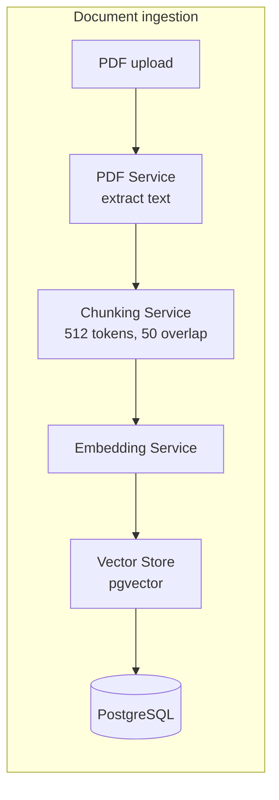
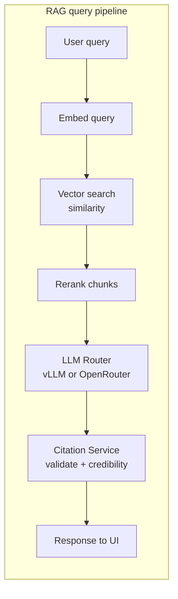
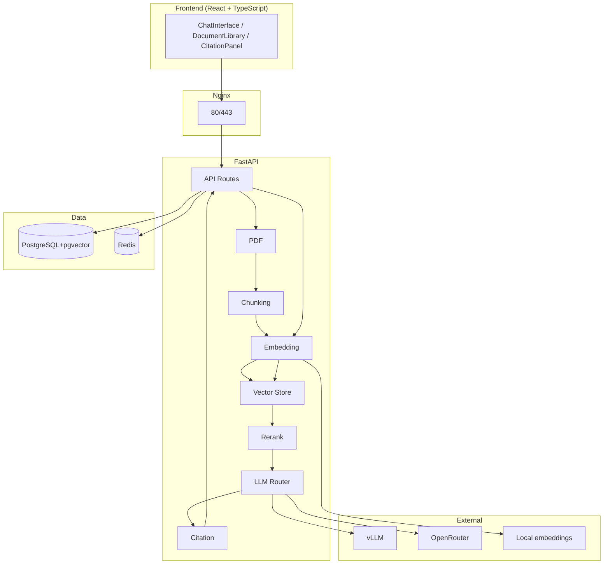

# RAG-v2.1 System Architecture

## Flow Diagrams

### 1. Document ingestion (upload pipeline)

When a user uploads a PDF, data flows in sequence:

### 2. Query / RAG flow (chat)

When a user sends a chat query, the pipeline runs in order:

### 3. Component topology

How services and data fit together:

## Component Descriptions

### Frontend
| Component | Description |
|-----------|-------------|
| **ChatInterface** | Main chat UI for querying documents with message display and citation links |
| **DocumentLibrary** | Document upload, list, and management interface |
| **CitationPanel** | Displays sources and evidence for LLM-generated answers |

### Backend Services
| Service | Description |
|---------|-------------|
| **PDF Service** | Parses uploaded PDFs, extracts text with page number tracking |
| **Embedding Service** | Generates vector embeddings using local models (sentence-transformers) or OpenAI |
| **Vector Store** | Qdrant/pgvector abstraction for similarity search and storage |
| **Rerank Service** | Re-ranks retrieved chunks for improved relevance |
| **LLM Router** | Routes requests to vLLM (local) or OpenRouter (cloud) with automatic fallback |
| **Citation Service** | Validates and extracts citations from LLM responses |
| **Chunking Service** | Splits documents into overlapping chunks (512 tokens, 50 overlap) |
| **OSINT Processor** | Processes open-source intelligence data |
| **Credibility Scorer** | Scores source credibility for citations |

### Data Layer
| Component | Description |
|-----------|-------------|
| **PostgreSQL + pgvector** | Primary database for metadata, conversations, and vector storage |
| **Redis** | Caching layer for performance optimisation |

### API Endpoints
| Endpoint | Method | Purpose |
|----------|--------|---------|
| `/auth/register` | POST | User registration |
| `/auth/login` | POST | User login, returns JWT token |
| `/documents/upload` | POST | Upload PDF documents |
| `/documents/` | GET | List all documents |
| `/chat/query` | POST | Main RAG query endpoint |
| `/logs/queries` | GET | Query audit logs |

## Operation Modes

| Mode | Configuration | Providers |
|------|---------------|-----------|
| **private** | Fully offline | vLLM + local embeddings |
| **hybrid** | Prefer local, fallback to cloud | vLLM → OpenRouter |
| **cloud** | Cloud-only | OpenRouter only |

## Data Flow Summary

1. **Document Ingestion**: PDF upload → Text extraction → Chunking → Embedding → Vector store
2. **Query Processing**: User query → Embedding → Vector search → Re-ranking → LLM generation → Citation validation → Response
