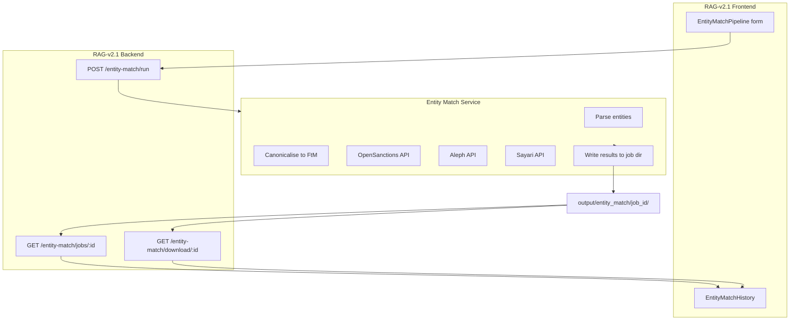

# Entity Match Integration Plan — RAG-v2.1 UI

Plan for adding an **Entity Match** tab to the RAG-v2.1 React frontend, with backend API support for fuzzy matching entities across multiple sources.

**Sources:** OpenSanctions, Aleph, Sayari (core) + ICIJ, OpenCorporates (already in codebase) + optional Wikidata, dilisense.

---

## 1. Current RAG-v2.1 Architecture

```
┌─────────────────────────────────────────────────────────────────────────┐
│  Frontend (React, port 3000)                                             │
│  Main tabs: Chat | Entity Extractor | Companies House | About            │
│  Each tab: SubTabBar [Main | History | Settings]                         │
└─────────────────────────────────────────────────────────────────────────┘
                                    │
                                    ▼
┌─────────────────────────────────────────────────────────────────────────┐
│  Backend (FastAPI, port 8010 via docker / 8000 standalone)              │
│  Routers: auth, documents, chat, logs, graph, ch                         │
│  CH pattern: POST /ch/run → job_id → GET /ch/jobs → GET /ch/download/:id │
└─────────────────────────────────────────────────────────────────────────┘
```

**Relevant files:**
- [frontend/src/App.tsx](frontend/src/App.tsx) — main tabs, SubTabBar, content routing
- [frontend/src/components/CompaniesHousePipeline.tsx](frontend/src/components/CompaniesHousePipeline.tsx) — pattern for pipeline UI
- [backend/api/routes/ch.py](backend/api/routes/ch.py) — pattern for run/jobs/download API
- [frontend/src/services/api.ts](frontend/src/services/api.ts) — API client

---

## 2. New Tab: Entity Match

### 2.1 Main tab entry

Add a fifth main tab alongside Chat, Entity Extractor, Companies House, About:

| Tab ID   | Label        | Icon        |
|----------|--------------|-------------|
| `entity-match` | Entity Match | `Search` or `Users` from lucide-react |

### 2.2 Sub-tabs

| Sub-tab ID | Label   | Content                          |
|------------|---------|----------------------------------|
| `match`    | Match   | Input form, run, results         |
| `history`  | History | Past runs, download              |
| `settings` | Settings| API keys (OpenSanctions, Aleph, Sayari, OpenCorporates) |

---

## 3. Frontend Components

### 3.1 EntityMatchPipeline.tsx (main)

**Layout:** Similar to CompaniesHousePipeline — card with form + results.

**Input section:**
- Tabs: "Single entity" | "CSV upload"
- **Single entity:**
  - Schema: dropdown `Person` | `Company`
  - Name (required)
  - Birth date, nationality (Person)
  - Jurisdiction, registration number (Company)
- **CSV upload:** File input; validate columns (schema, name, …)
- **Source checkboxes:** OpenSanctions, Aleph, Sayari, ICIJ, OpenCorporates (optional: Wikidata, dilisense)
- **Run** button

**Results section:**
- After run: table of matches (query name, source, matched entity, score, details)
- Per-source expanders or tabs
- **Output format selector:** CSV | JSON | Report
- **Report:** Markdown with breakdown (what was found where), cross-source view
- **Graph:** Interactive graph of query entities → matched entities (vis.js/D3 style)
- Download: CSV, JSON, or Report (MD + embedded graph data)

### 3.2 EntityMatchHistory.tsx

- List past runs (job_id, created_at, entity count, match count)
- Download results per run
- Delete run (optional)

### 3.3 EntityMatchSettings.tsx

- API keys (stored in UnifiedConfigContext or .env):
  - `OPENSANCTIONS_API_KEY`, `ALEPH_API_KEY`, `SAYARI_CLIENT_ID`/`CLIENT_SECRET`, `OPENCORPORATES_API_KEY`
- Optional: FTM file path for local screening
- Source toggles (OpenSanctions, Aleph, Sayari, ICIJ, OpenCorporates; optional Wikidata, dilisense)

### 3.4 UnifiedConfigContext

Extend config to include `entityMatch`:

```ts
entityMatch: {
  openSanctionsApiKey: string;
  alephApiKey: string;
  sayariClientId: string;
  sayariClientSecret: string;
  openCorporatesApiKey: string;
  defaultSources: string[];  // ['opensanctions', 'aleph', 'sayari', 'icij', 'opencorporates']
}
```

---

## 4. Backend API

### 4.1 New router: `api/routes/entity_match.py`

| Method | Endpoint | Purpose |
|--------|----------|---------|
| POST | `/entity-match/run` | Start match job; returns `job_id` |
| GET | `/entity-match/jobs` | List jobs with metadata |
| GET | `/entity-match/jobs/{job_id}` | Job status + results summary |
| GET | `/entity-match/jobs/{job_id}/results` | Full results JSON |
| GET | `/entity-match/download/{job_id}` | Download results CSV/JSON |
| DELETE | `/entity-match/jobs/{job_id}` | Delete job output |

### 4.2 Request/response schemas

**POST /entity-match/run**

```json
{
  "entities": [
    { "schema": "Person", "name": "John Doe", "birthDate": "1982", "nationality": "gb" },
    { "schema": "Company", "name": "Acme Ltd", "jurisdiction": "gb", "registrationNumber": "12345678" }
  ],
  "sources": ["opensanctions", "aleph", "sayari", "icij", "opencorporates"],
  "api_keys": {
    "opensanctions": "optional override",
    "aleph": "optional override",
    "sayari": "optional override",
    "opencorporates": "optional override"
  }
}
```

**Response:** `{ "job_id": "uuid", "status": "started" }`

**GET /entity-match/jobs/{job_id}**

```json
{
  "job_id": "uuid",
  "status": "completed",
  "created_at": "ISO8601",
  "entity_count": 2,
  "results": {
    "opensanctions": { "match_count": 1, "matches": [...] },
    "aleph": { "match_count": 3, "matches": [...] },
    "sayari": { "match_count": 0, "matches": [] },
    "icij": { "match_count": 0, "matches": [] },
    "opencorporates": { "match_count": 2, "matches": [...] }
  }
}
```

### 4.3 Entity match service

**Option A — In-process (recommended):** Add `services/entity_match/` to RAG-v2.1 backend:

- `run.py` — orchestrate match pipeline
- `adapters/opensanctions_api.py` — POST to OpenSanctions match API
- `adapters/aleph.py` — GET Aleph entities
- `adapters/sayari.py` — Sayari Resolution / Entity Search
- `adapters/icij.py` — ICIJ Reconciliation API (or reuse entitytrace)
- `adapters/opencorporates.py` — Officers/company search (or reuse entitytrace)
- `canonicalise.py` — CSV/JSON → FtM format

**Option B — External:** Call entitytrace (or standalone script) as subprocess; RAG backend only manages job dirs and file I/O. Simpler but less integrated.

**Recommendation:** Option A for tighter integration; reuse logic from entitytrace where possible (e.g. copy `entitytrace/core/matching.py` or add entitytrace as optional dependency).

---

## 5. Data flow



---

## 6. File changes checklist

### Frontend

| File | Change |
|------|--------|
| `App.tsx` | Add `entity-match` to `MainTab`; add `EntityMatchSubTab`; add main tab button; add content block with SubTabBar + EntityMatchPipeline / EntityMatchHistory / EntityMatchSettings |
| `SubTabBar.tsx` | Add `violet` or `cyan` to `accentColor` for Entity Match |
| `EntityMatchPipeline.tsx` | **New** — form, run, results table, download |
| `EntityMatchHistory.tsx` | **New** — list jobs, download, delete |
| `EntityMatchSettings.tsx` | **New** — API keys, default sources |
| `api.ts` | Add `runEntityMatch`, `listEntityMatchJobs`, `getEntityMatchJob`, `getEntityMatchDownloadUrl`, `deleteEntityMatchJob` |
| `UnifiedConfigContext.tsx` | Add `entityMatch` config slice |
| `types/index.ts` | Add `EntityMatchJob`, `EntityMatchResult` types |

### Backend

| File | Change |
|------|--------|
| `main.py` | `from api.routes import ..., entity_match`; `app.include_router(entity_match.router)` |
| `api/routes/entity_match.py` | **New** — router, run, jobs, download, delete |
| `services/entity_match/run.py` | **New** — orchestration |
| `services/entity_match/adapters/opensanctions_api.py` | **New** — OpenSanctions match API client |
| `services/entity_match/adapters/aleph.py` | **New** — Aleph search (or import from entitytrace) |
| `services/entity_match/adapters/sayari.py` | **New** — Sayari (stub until API known) |
| `services/entity_match/canonicalise.py` | **New** — CSV/JSON → FtM |
| `models/schemas.py` | Add `EntityMatchRunRequest`, `EntityMatchJobResponse` |
| `core/config.py` | Add `ENTITY_MATCH_OUTPUT_DIR`, optional API key defaults |

---

## 7. Output directory layout

```
output/entity_match/
  {job_id}/
    metadata.json      # job_id, created_at, entity_count, sources
    results.json       # full results per source (programmatic)
    results.csv        # flattened tabular export
    report.md          # human-readable report: breakdown by source, cross-source view
    graph.json         # nodes + edges for UI graph (query → matched entities)
    summary.json       # match counts per source, run metadata
```

**Output format options (user-selectable):**
- **CSV** — Tabular: query_entity, source, matched_id, matched_name, score, datasets
- **JSON** — Full structured results for programmatic use
- **Report** — Markdown with per-source breakdown, cross-source summary, graph visual (nodes = query + matched entities; edges = source + score)

---

## 8. Dependencies

- **Backend:** `requests` (already present); no new deps for basic OpenSanctions/Aleph HTTP calls
- **Optional:** `entitytrace` package if importing matching logic — requires workspace layout or pip install from Aleph repo

---

## 9. API authorization

| Source | Auth | Link |
|--------|------|------|
| **Sayari** | CLIENT_ID + CLIENT_SECRET | [Credentials Request](https://docs.google.com/forms/d/e/1FAIpQLSeNWb-cwVCPjvf4x0xEidZRKjMN9kWcSGv7Y8AcykUQDzy7Yg/viewform) |
| **Aleph** | API key (manual review) | [OCCRP Aleph Registration](https://requests.occrp.org/register) |
| **OpenSanctions** | API key (free non-commercial) | [API sign-up](https://www.opensanctions.org/api/) |
| **OpenCorporates** | API token (free for open data) | [OpenCorporates Pricing](https://opencorporates.com/pricing/) |
| **ICIJ** | None (rate-limited) | [Reconciliation API](https://offshoreleaks.icij.org/docs/reconciliation) |
| **Wikidata** | None | [Wikidata REST API](https://www.wikidata.org/wiki/Wikidata:REST_API) |
| **dilisense** | Free tier | [dilisense](https://dilisense.com/en) |

---

## 10. Environment variables

| Variable | Purpose |
|---------|---------|
| `OPENSANCTIONS_API_KEY` | OpenSanctions match API (optional for local FTM) |
| `ALEPH_API_KEY` | OCCRP Aleph entity search |
| `SAYARI_CLIENT_ID`, `SAYARI_CLIENT_SECRET` | Sayari OAuth (Resolution / Entity Search) |
| `OPENCORPORATES_API_KEY` | OpenCorporates officer/company search |
| `ENTITY_MATCH_OUTPUT_DIR` | Default: `output/entity_match` |

ICIJ and Wikidata require no keys.

---

## 11. Implementation order

1. Backend: `entity_match` router + minimal `run` service (OpenSanctions + Aleph only)
2. Frontend: EntityMatchPipeline (single entity, no CSV yet)
3. Frontend: EntityMatchHistory, Settings
4. Backend: CSV upload support
5. Backend: Sayari adapter (docs public at documentation.sayari.com; requires credentials)
6. Frontend: CSV upload UI, polish
