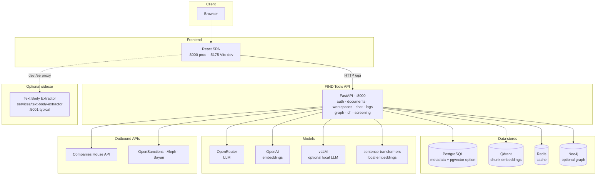
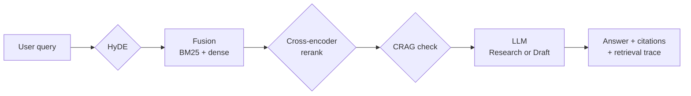

# FIND Tools (RAG-v2.1)

The repository folder is `RAG-v2.1`; the product UI and OpenAPI title are **FIND Tools** — a browser-based Retrieval-Augmented Generation (RAG) stack for discussing large document sets with grounded, citation-backed answers, plus optional investigation tooling (graph, UK company data, name screening).

## What you get

### Core RAG (Chat)

- **Ingestion**: Docling when `ENABLE_DOCLING` is on and the package is available (multi-format: PDF, DOCX, PPTX, XLSX, HTML, images where supported); otherwise **PyMuPDF** for PDF-focused paths.
- **Chunking**: Strategies include `auto`, sections, paragraphs, sliding, and semantic (embedding-similarity boundaries).
- **Retrieval**: Fusion of **BM25 + dense** vectors (Reciprocal Rank Fusion) when `ENABLE_FUSION_RETRIEVAL` is on; optional **cross-encoder rerank** (`ENABLE_CROSS_ENCODER_RERANK`).
- **HyDE** for short or vague queries (`ENABLE_HYDE`).
- **Corrective RAG**: Retrieval self-check and optional web fallback (`ENABLE_CORRECTIVE_RAG`).
- **Fast path**: `RAG_LOW_LATENCY=true` turns off HyDE, fusion, CRAG, and cross-encoder rerank for quicker turns.
- **Stability presets**: `RUNTIME_STABILITY_PROFILE` — `custom`, `stability_safe`, or `stability_full` (see `.env.example`).
- **LLM routing**: **OpenRouter** (cloud) with optional **vLLM** when `ENABLE_VLLM` is set for private/hybrid modes; UI supports **Research** (selected model) vs **Draft** (server “fast” model, `OPENROUTER_FAST_MODEL`).
- **Citations & trace**: Answers carry source references; responses can include **retrieval trace** (HyDE, fusion, CRAG, per-chunk ranks).
- **Workspaces**: Optional case-style labels filter the library; uploads can target a workspace.
- **Corpus search**: `GET /documents/search?q=…` — quick search across indexed chunk text and titles.
- **Conversations & logs**: Stored conversations, query audit (`/logs/queries`), optional DeepEval-style evaluation endpoint.

### Other UI areas (same shell)

| Area | Role |
|------|------|
| **Entity Extractor** | Calls the bundled **Text Body Extractor** in `services/text-body-extractor` (proxied as `/ee` in Vite dev). |
| **Companies House** | UK company pipeline and filings via backend routes under `/ch` (API key from env or UI). |
| **Name screening** | Server-side lookups (OpenSanctions / Aleph / Sayari) when keys are set — see `.env.example`. |
| **Tools** | Shortcuts into other tabs (memory, extractor, about). |
| **About** | Product information. |

### Knowledge graph (optional)

- **Neo4j** (Aura or local): entity graph build, browse, and natural-language graph queries via `/graph/*` when configured.
- `GET /health` reports Neo4j connectivity alongside LLM providers.

### Auth

- JWT-based **register / login** under `/auth` for deployments that enable it (see backend routes).

## Architecture (high level)

### System context



### Chat / RAG query path

Configurable flags can skip steps (e.g. `RAG_LOW_LATENCY`).



Embeddings at ingest and query time use local **sentence-transformers** and/or **OpenAI**, depending on mode and keys.

## Quick start

### Prerequisites

- Docker and Docker Compose
- (Optional) OpenRouter and OpenAI keys for cloud LLM + embeddings
- (Optional) vLLM for local inference; Neo4j for graph features

### Configure

```bash
cd RAG-v2.1
cp .env.example .env
# Set DATABASE_URL / keys as needed — see comments in .env.example
```

Note: `.env.example` lists `PORT=8010` for documentation of alternate deployments; the **bundled FastAPI app listens on 8000** (`backend/main.py`, Docker `backend` service).

### Run with Docker Compose

```bash
docker compose up -d
```

Typical ports:

| Service | Port |
|---------|------|
| Frontend (nginx → static build) | **3000** |
| API | **8000** |
| PostgreSQL | 5432 |
| Qdrant | 6333 (HTTP), 6334 (gRPC) |
| Redis | 6379 |

Open **http://localhost:3000**. API docs: **http://localhost:8000/docs**.

### Local API with a venv (optional)

Useful when databases run in Docker but you run the API on the host:

1. **Python 3.12** recommended (pinned deps such as `qdrant-client` may not install on 3.13).
2. From `RAG-v2.1`:
   ```bash
   python3.12 -m venv venv
   ./venv/bin/pip install -r backend/requirements.txt
   ```
3. Point `.env` at `127.0.0.1` for Postgres, Qdrant, and Redis (not Docker service hostnames).
4. Start infra only if needed: `docker compose up -d postgres qdrant redis`
5. Run: `./scripts/run_backend_venv.sh` (after `chmod +x` once).

### Frontend dev server

```bash
npm install
npm run dev
```

Runs Vite on **http://localhost:5175** with `/api` proxied to **http://localhost:8000** and `/ee` to the entity extractor on **5001** if you use that feature.

### Optional: Entity Extractor (Text Body Extractor)

The repo includes **`services/text-body-extractor`** (FastAPI). For URL/text entity extraction, run `./start_backend.sh` from that directory (default **PORT=5001** in `.env` to match the Vite `/ee` proxy), or `docker compose --profile entity-extractor up -d text-body-extractor`. In Docker, the main RAG backend can use `ENTITY_EXTRACTOR_URL` (e.g. `http://host.docker.internal:5001` when the extractor runs on the host, or `http://text-body-extractor:8000` when using the Compose service).

### Optional: Neo4j for graph + EE “push”

- Neo4j Aura: set `NEO4J_URI`, `NEO4J_USERNAME`, `NEO4J_PASSWORD` in `.env`.
- Local Docker: see commented `neo4j` service in `docker-compose.yml`.

## Operation modes

| Mode | Behaviour |
|------|-----------|
| `private` | Local-first: vLLM + local embeddings (requires local stack and keys as per config). |
| `hybrid` | Prefer local providers when available, otherwise cloud. |
| `cloud` | OpenRouter + cloud embeddings (typical for hosted deploys). |

Priority in hybrid/private is governed by `ENABLE_VLLM`, running vLLM, and configured API keys.

## Verification

```bash
cd RAG-v2.1
python verify_system.py
```

API-only smoke:

```bash
python verify_system.py --smoke
```

Options: `--base-url`, `--frontend-url`. More detail: [TESTING.md](TESTING.md).

## API surface (summary)

Full interactive docs: `/docs` on the API host.

| Prefix | Purpose |
|--------|---------|
| `/auth` | Register, login, `me` |
| `/documents` | Upload, list, search, chunks, rechunk, delete |
| `/workspaces` | Investigation workspaces |
| `/chat` | Query, conversations, models, evaluate |
| `/logs` | Query audit logs and stats |
| `/graph` | Neo4j status, build, search, NL query |
| `/ch` | Companies House pipeline jobs, filings, downloads |
| `/screening` | Name screening status and search |

## Licence

MIT
