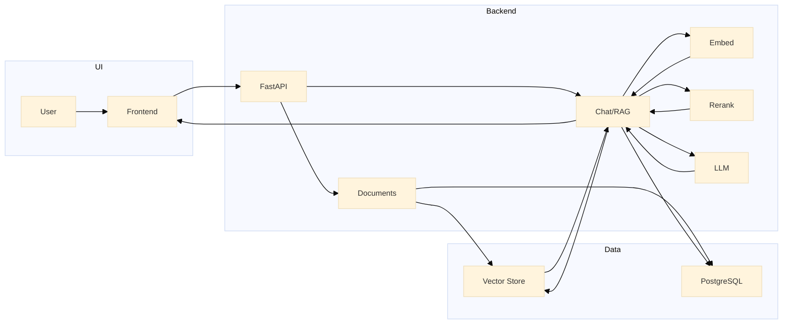
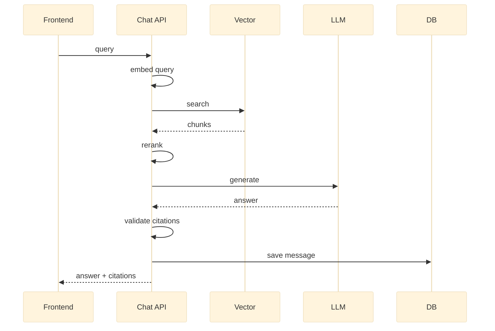

## RAG-v2.1 – System Flow

This document shows the main data and control flow for the RAG-v2.1 system.

### High-level architecture

### RAG query pipeline (simplified)

The `/chat/query` flow: embed → search → rerank → prompt LLM → validate citations → save & return.

### Why it is structured this way

- **Separation of concerns**: each service (`embedding_service`, `vector_store`, `rerank_service`, `llm_router`, `citation_service`) owns one stage of the pipeline, which keeps the RAG logic in `chat.py` readable and easy to change.
- **Pluggable providers**: the `llm_router` and `vector_store` abstractions allow you to swap between local and cloud LLMs or different vector backends without rewriting the business logic.
- **Auditing and reproducibility**: messages, retrieved chunks, and validated citations are stored in PostgreSQL so you can trace exactly how each answer was produced and debug issues later.
- **Performance and resilience**: background logging and short health‑check timeouts keep the main query path responsive while still exposing enough telemetry for monitoring.

