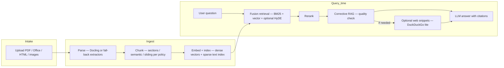

# Chat — investigations brief

**Audience:** Investigators and intelligence leads  
**Purpose:** Explain grounded Q&amp;A over your own document corpus — retrieval, generation, citations, and optional web fallback.

---

## 1. Why this exists

Investigations accumulate **large, heterogeneous documents** (PDFs, office files, exports). Chat turns that corpus into something you can **query in natural language** while **forcing answers to cite** retrieved passages — reducing unsupported claims and making peer review faster.

---

## 2. Relationship to the sidebar (document library)

You **upload or select documents** from the library. Chat can run **against one selected document** or **across all indexed material**, depending on selection. Ingestion, chunking, and embedding happen on the server after upload.

---

## 3. End-to-end pipeline (conceptual)

| Stage | Investigative value |
|--------|----------------------|
| **Ingest** | Normalises messy formats into searchable text. |
| **Chunk + embed** | Finds *passages*, not just filenames — better precision for long reports. |
| **Fusion retrieval** | Lexical + semantic recall reduces “missed” mentions (names, numbers, exact phrases). |
| **HyDE** *(if enabled)* | Expands vague questions into richer retrieval queries. |
| **Rerank** | Surfaces the most relevant chunks before the model reads them. |
| **Citations** | Every answer maps to **document + page** (or chunk anchor) for audit. |
| **Corrective RAG** | If retrieval looks weak, the system may **augment** with a small set of **web snippets** (no paid search API — see credentials). |

---

## 4. “Datasets” and stores (what the system actually searches)

| Layer | What it holds |
|--------|----------------|
| **Your uploaded files** | The only **private** evidence base the tab is designed around. |
| **Vector index (e.g. Qdrant)** | Dense embeddings for semantic similarity. |
| **Metadata / lexical store (PostgreSQL family)** | Document records, chunk text, BM25-style access. |
| **Web snippets** *(conditional)* | Ephemeral context from **DuckDuckGo HTML lite** when corrective RAG triggers — **not** a curated dataset. |

There is **no** sanctioned third-party entity index inside Chat itself; that is the role of a separate **entity screening** roadmap (see tab briefs index).

---

## 5. What the client must provide (credentials and hosting)

### 5.1 Organisation runs the stack

- **Container host** (or equivalent) for API, databases, and vector store.
- **Database password** and storage for vectors — operational, not end-user keys.

### 5.2 Language model and embeddings (pick from deployment mode)

| Mode (typical) | Client provides | Cost feel |
|----------------|-----------------|-----------|
| **Private / local** | **vLLM** (or compatible) endpoint reachable from backend; compute hardware | Infra / GPU — no per-token cloud bill |
| **Hybrid / cloud** | **OpenRouter** API key for chat models; often **OpenAI** (or configured provider) for **embeddings** when not fully local | **Paid** cloud usage |
| **CRAG web fallback** | **No API key** — uses DuckDuckGo lite HTML; depends on **outbound network** from backend |

Frontend **Chat → Settings** controls **prompt templates** and **model choice** from what the API exposes; **secrets** for cloud inference normally live in **server environment**, not only in the browser.

---

## 6. Expected outcomes

- **Answers grounded in your documents**, with **numbered citations** and a **Sources** side panel showing the retrieved chunks.
- **Conversation continuity** via **History** (server-backed conversations, subject to your retention policy).
- **Optional** enrichment from **open web snippets** when internal retrieval is thin — clearly separated from your uploads in the prompt assembly.

---

## 7. User interface (actual behaviour)

| Area | Behaviour |
|------|------------|
| **Chat** | Message thread; header shows **selected document** (single-doc mode) or **All Documents**. |
| **Model menu** | Pick from **local (vLLM)** vs **cloud (OpenRouter)** models exposed by the API. |
| **Sources** | Toggle panel listing citations and chunk text behind the latest reply. |
| **History** | Reload prior conversations. |
| **Settings** | System prompt style (e.g. default, OSINT-flavoured, analytical), model selection, high-level module notes. |

---

## 8. Operational notes

- **Grounding:** Prompts instruct the model to stay within context; investigators should still **spot-check** citations for high-stakes decisions.
- **Web augmentation:** Snippets are **unverified third-party pages** — treat as leads, not evidence.
- **Privacy:** **Private mode** keeps inference and data on your estate; cloud keys send **queries and retrieved text** to external model providers per their terms.

---

*Document version: aligned with RAG-v2.1 Chat tab and backend retrieval stack as described in product README.*
