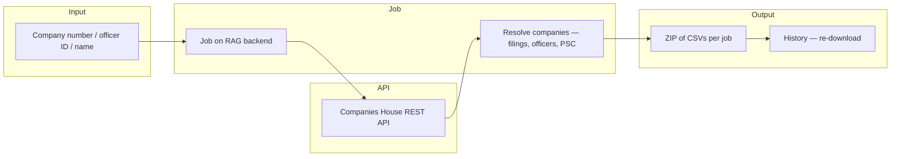
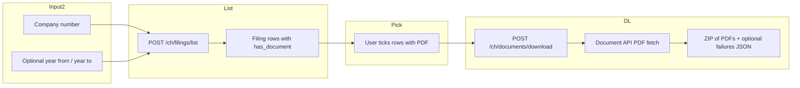

# Companies House — investigations brief

**Audience:** Investigators and intelligence leads (UK corporate footprint)  
**Purpose:** Pull **registered company facts**, **filings**, **officers**, and **persons with significant control (PSC)** from **UK Companies House** into downloadable **CSVs** for analysis or graph tooling; optionally **list filings** and **download selected filing PDFs** via the Companies House **Document API**.

---

## 1. Why this exists

UK entities and their **officers / PSCs** are foundational in **fraud**, **sanctions evasion**, and **shell-company** work. This tab wraps a **repeatable pipeline**: you supply a **company number**, **officer identifier**, or **name**; the system fetches structured registry data and packages **tabular outputs** per job. For **primary-source documents** (accounts, annual returns, etc.), a **separate list-then-download** flow fetches **PDFs** for chosen filings without mixing heavy binary work into the CSV export.

---

## 2. End-to-end pipelines (conceptual)

### 2.1 CSV / graph pipeline (search → Neo4j-style CSVs)

### 2.2 Filing PDFs (list metadata → download selected)

Neater than a single “do everything” step: **metadata first**, **binaries second**.

| Stage | Investigative value |
|--------|----------------------|
| **Company number** | Strongest key — direct profile and filing index. |
| **Officer ID** | Anchors a **specific** director record; expands to appointment network. |
| **Name search** | Exploratory — higher **false-positive** load; pair with other attributes outside the registry when possible. |
| **PSC** | Reveals **beneficial ownership** fields where filed. |
| **CSV bundle** | Fits **Excel**, **Python**, or **Neo4j bulk load** workflows. |
| **Filing PDF list** | See **what exists** before download; filter by **calendar year**. |
| **Selected PDFs** | **Primary documents** for close reading or offline archive; failures listed in `download_failures.json` inside the ZIP when some items error. |

---

## 3. “Dataset”

| Source | Coverage |
|--------|----------|
| **Companies House** (UK government) | UK-registered companies and LLPs, officers, PSCs, and public filings exposed via the **developer API**. |
| **Document API** (same developer key) | Binary filing content (typically **PDF**) where the filing exposes `document_metadata` in filing history. Not every filing has a downloadable document. |

This is **authoritative public registry data**, not a commercial risk score. Interpretation (e.g. nominee patterns) remains **analyst judgement**.

---

## 4. What the client must provide (credentials)

| Item | Required? | Typical cost |
|------|-----------|--------------|
| **Companies House API key** | **Recommended** — API works with anonymous rate limits but a key **raises quotas** | **Free** — register at **Companies House developer** portal |
| **Server environment key** | Many deployments also set `COMPANIES_HOUSE_API_KEY` on the **backend** for jobs | Same free developer key |

Analysts can mirror the key into **Companies House → Settings** in the browser so the UI can pass it with requests depending on deployment.

---

## 5. Expected outcomes

**CSV pipeline**

- **Job summary** — counts such as companies touched, filings, officers, PSC rows (as implemented per pipeline version).
- **Downloadable ZIP** of **CSVs** for the run.
- **History** — list past jobs and **re-download** without repeating the full fetch where cached.

**Filing PDFs**

- **List** — filings with **date**, **type**, **description**, **has_document** (and internal `document_id` for the download step).
- **Year filter** — optional **year from** / **year to** (calendar year on filing date).
- **Download job** — ZIP of **PDFs** (filename pattern includes date, type, transaction id); **`download_failures.json`** if some rows could not be retrieved.
- **History** — document jobs appear alongside CSV jobs; download uses the same **History** and **Download** pattern (ZIP may contain CSVs **or** PDFs depending on job type).

---

## 6. User interface (actual behaviour)

| Sub-tab | Behaviour |
|---------|------------|
| **Companies House** | **CSV pipeline:** choose **search type** (company number, officer ID, name); enter value(s); **Run pipeline**; **Download CSVs** when the job completes. **Filing documents:** enter **company number**; optional **year from / year to**; **List filings**; tick rows that show **PDF** (or **Select all with PDF**); **Download selected PDFs**; **Download ZIP** when the job completes. |
| **History** | Prior jobs (CSV and PDF bundles) and downloads. |
| **Settings** | Paste **API key**; link to official developer signup. |

---

## 7. Operational notes

- **Rate limits:** Without a key, bulk work may **throttle**; procure a key before team-wide use. PDF download issues many sequential requests — keep selections reasonable (the backend enforces a **maximum number of documents per job**).
- **Name ambiguity:** Name search returns **candidates** — always corroborate with DOB fragments, address, or parallel sources where available.
- **Jurisdiction:** Data is **UK-only** for this integration; foreign registers need **other** tools or tabs.
- **Not every filing has a PDF:** Rows without a document cannot be ticked; the list step is there to make that visible before download.

---

*Document version: aligned with RAG-v2.1 Companies House tab — UK API and Document API.*
