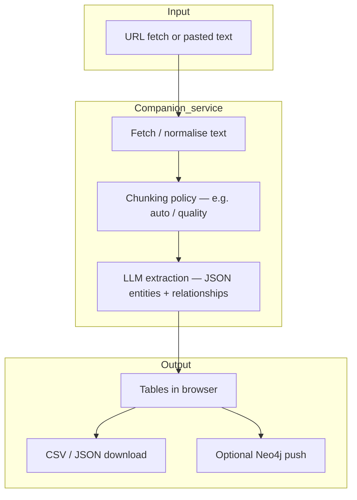

# Entity Extractor — investigations brief

**Audience:** Investigators and intelligence leads  
**Purpose:** Turn unstructured **URLs or pasted text** into **structured entities and relationships**, with optional **graph export**.

---

## 1. Why this exists

Briefings, articles, and disclosure packs are full of **names, organisations, and ties**. Manual extraction is slow and inconsistent. This tab uses an **LLM-guided extractor** (via a companion extraction service) to propose **entities** (with types) and **relationship edges**, then lets you **export** or **push to a graph database** for follow-on analysis.

---

## 2. End-to-end pipeline (conceptual)

| Stage | Investigative value |
|--------|----------------------|
| **URL / text** | Works on **open web pages** or **offline pasted content** you are allowed to process. |
| **Chunking** | Long pages are split so the model sees manageable windows (strategy affects recall). |
| **LLM JSON** | Consistent shape: entities with labels, relationships with types — good for **import into other tools**. |
| **Neo4j** *(optional)* | Turns a narrative into a **queryable graph** for link tracing. |

---

## 3. “Datasets” and dependencies

| Component | Role |
|-----------|------|
| **Target webpage or text** | **Your** input — not a preloaded third-party database. |
| **Extraction backend** | Separate service the RAG deployment reaches over HTTP (`ENTITY_EXTRACTOR_URL` style configuration on the server). |
| **Neo4j** *(optional)* | **Your** graph store — Aura or self-hosted. |

There is **no built-in sanctions or leaks index** here; extracted names can feed **downstream** checks (e.g. screening workflows elsewhere).

---

## 4. What the client must provide (credentials)

### 4.1 Always required for extraction (LLM bill)

| Item | Notes |
|------|--------|
| **OpenRouter API key** *or* **OpenAI API key** | Chosen in **Entity Extractor → Settings**; bearer for whichever provider you select. Both are **paid** cloud APIs (usage-based). |
| **Extraction service running** | Ops must start / host the OOCP-style backend and point the RAG API at it. |

### 4.2 Optional graph push

| Item | Notes |
|------|--------|
| **Neo4j URI, username, password** | Entered in **Settings** (or configured on extraction service per deployment guide). **Neo4j Aura** is typical paid SaaS; self-hosted has infra cost, no Aura bill. |

### 4.3 No extra key for “entity types”

The **ontology** (people, orgs, locations, etc.) comes from **prompting**, not from a licensed entity master list inside this tab.

---

## 5. Expected outcomes

- **Interactive tables** of entities and relationships with errors visible to the analyst.
- **CSV / JSON** downloads for spreadsheets or pipelines.
- **Neo4j push** when connected — enables Cypher and link charts in external tools.
- **Prompt templates** can be pulled from the extraction service defaults for consistency across the team.

---

## 6. User interface (actual behaviour)

| Sub-tab | Behaviour |
|---------|------------|
| **Entity Extractor** | Toggle **URL** vs **text**; run extraction; view tables; download; **Push to Neo4j** when available. |
| **History** | **Not persisted** — message explains past runs are only within the **current browser session** on this UI path. |
| **Settings** | Provider (**OpenRouter** / **OpenAI**), keys, model pick list, Neo4j connection, auto-push preference. |

---

## 7. Operational notes

- **Hallucination risk:** Models can invent **edges** or **miss** facts. Treat output as **draft structured intel**, not court-grade extraction without review.
- **Website terms:** Fetching URLs must comply with **robots**, **copyright**, and **CFAA-style** constraints in your jurisdiction.
- **Segregation:** API keys in the **browser** mean **credential handling** must match your infosec policy (consider managed configs or server-side proxying if required).

---

*Document version: aligned with RAG-v2.1 Entity Extractor tab and optional OOCP / Neo4j architecture.*
