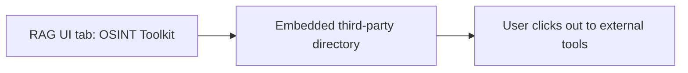

# OSINT Toolkit — investigations brief

**Audience:** Investigators and intelligence leads  
**Purpose:** Provide **quick access** to the public **OSINT Framework** taxonomy of tools and techniques from inside the workspace — **without** routing case data through RAG servers.

---

## 1. Why this exists

Investigators constantly pivot between **document work** inside RAG and **open-source lookups** (social, WHOIS, maps, archives). This tab embeds a **well-known curated directory** so analysts can jump to categories of tools while staying in one browser window. It is a **convenience layer**, not a data integration.

---

## 2. Pipeline

There is **no retrieval or extract-transform-load pipeline** inside your deployment for this tab.

| Stage | Investigative value |
|--------|----------------------|
| **Directory** | **Discovery** — reminds the team which classes of OSINT exist (username, image, domain, etc.). |
| **External tools** | Actual lookups happen on **other sites** under those tools’ **terms and OPSEC** rules. |

---

## 3. “Datasets”

| Item | Role |
|------|------|
| **OSINT Framework website** | A **link hub** maintained by its authors; RAG does **not** mirror or index its content. |
| **Destination tools** | Each target site has **its own** data policy — analyst responsibility. |

---

## 4. What the client must provide (credentials)

| Item | Notes |
|------|--------|
| **Nothing to RAG** | The iframe loads a **public URL**; your stack does not issue API keys for it. |
| **Outbound HTTPS** | The analyst workstation (or thin client) must allow browsing **osintframework.com** and linked domains. |
| **Per-tool accounts** | Some linked resources need **paid** or **logged-in** access on **those** vendors — entirely outside this tab. |

**Embedding caveat:** Some sites send **X-Frame-Options** headers; if the directory blocks iframes in your network, use **Open in new tab** (provided in the UI).

---

## 5. Expected outcomes

- **Faster orientation** for junior analysts learning OSINT categories.
- **No audit trail inside RAG** of which external tool was used — operational security and logging are **browser / enterprise proxy** concerns.

---

## 6. User interface (actual behaviour)

- **Full-height iframe** to the OSINT Framework entry page.
- **“Open in new tab”** control top-right if embedding fails or you prefer a separate window.

---

## 7. Operational notes

- **Case separation:** Treat this as **uncontrolled browsing** — do not paste **classified** or **legally restricted** material into arbitrary third-party search boxes.
- **Compliance:** Your organisation’s **internet use** and **vendor due diligence** policies apply to every destination link.

---

*Document version: aligned with RAG-v2.1 OSINT Toolkit tab — embed-only integration.*
