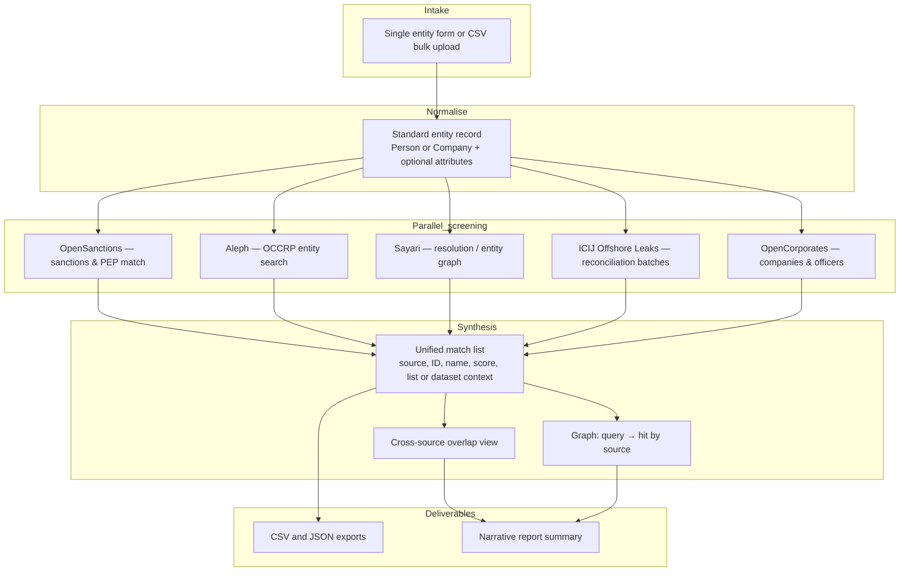

# Multi-source entity screening — investigations brief

**Other tabs:** see [RAG_TAB_BRIEFS_INDEX.md](./RAG_TAB_BRIEFS_INDEX.md).

**Audience:** Investigators and intelligence leads  
**Purpose:** Explain how a single workflow replaces parallel manual checks across sanctions, leaks, corporate, and commercial intelligence sources.

---

## 1. Why this exists

Investigations often start with **partial identity**: a name, a company, maybe a jurisdiction or year of birth. Today, confirming whether that footprint appears in **sanctions listings**, **document leaks**, **corporate registries**, or **commercial risk graphs** means repeating the same entity in several tools and reconciling different scores and identifiers by hand.

The intended capability is **one submission, many sources**: you describe people and companies once; the platform **normalises** that description, **queries each enabled dataset in parallel**, and returns a **unified view** of hits — including who matched **more than one** system, which is often the highest signal.

---

## 2. End-to-end pipeline (conceptual)

The flow below is the **story** from intake to evidence, not a wiring diagram of any single vendor.

**How each stage helps investigations**

| Stage | Investigative value |
|--------|----------------------|
| **Intake** | Capture what you actually know — names, companies, optional attributes — without fighting five different query languages. |
| **Normalise** | Every downstream path uses the **same** structured entity, reducing “close but not quite” mismatches caused by ad-hoc typing. |
| **Parallel screening** | **Breadth**: OpenSanctions, Aleph, Sayari, ICIJ leaks reconciliation, and OpenCorporates run together; optional Wikidata / dilisense if enabled. |
| **Synthesis** | **Depth**: comparable scores, explicit source attribution, and overlap across sources — the fastest route to “is this the same person/company everywhere?”. |
| **Deliverables** | **Continuity**: spreadsheets and JSON for case systems; prose summary and link graph for briefings and peer review. |

---

## 3. Datasets in the pipeline (named sources)

These are the **live integrations** the screening flow is built around. **Underlying lists** (e.g. national sanctions lists aggregated inside OpenSanctions, or specific Aleph collections) appear in API responses as **dataset or collection identifiers** — the investigator sees both the **portal name** and those **specific hits**.

| Source | What it brings to the pipeline | Examples of what hits can represent |
|--------|--------------------------------|-------------------------------------|
| **OpenSanctions** | Query-by-example match against a **consolidated entity index** | Sanctions listings (many jurisdictions), PEPs, crime-linked and other policy-relevant entities — actual **dataset codes** (e.g. US OFAC, EU, UK lists) are returned per match |
| **Aleph (OCCRP)** | **Full-text style search** over the OCCRP Aleph investigative archive | Documents, entities, and collections tied to **public-interest investigations and leaks** surfaced as the user would in Aleph search |
| **Sayari** | **Resolution / entity search** mapped from your normalised person or company | Commercial **corporate graph**, related parties, and risk-oriented signals (exact fields depend on Sayari product access) |
| **ICIJ Offshore Leaks** | **Reconciliation API** — batch compare your entities against the leaks index | **Panama Papers, Paradise Papers, Pandora Papers**, and related **Offshore Leaks** structures where published |
| **OpenCorporates** | **Company and officer** search | Registered entities and officer names across **many corporate registers** (coverage varies by jurisdiction) |
| **Wikidata** *(optional)* | **Public knowledge graph** search | Disambiguation and structured IDs for names that collide across languages or scripts |
| **dilisense** *(optional)* | **Alternative** sanctions / PEP-style screen | Second-channel fuzzy screen; useful where policy allows dual-vendor checking |

Tiering in delivery is usually: **OpenSanctions + Aleph + Sayari** as core breadth; **ICIJ + OpenCorporates** as extended reach; **Wikidata + dilisense** as optional.

---

## 4. What the client must provide (credentials)

The platform **orchestrates** calls; **your organisation** supplies keys or registrations so outbound requests are authorised. Below is a practical split: **no key**, **free (but registered)**, and **paid / commercial approval**.

### 4.1 No API key

| Source | Client provides | Notes |
|--------|-----------------|--------|
| **ICIJ Offshore Leaks** | Nothing | Public reconciliation endpoint; **rate limits** apply — bulk work should be paced |
| **Wikidata** | Nothing | Optional disambiguation only |

### 4.2 Free or low-friction API access *(still requires account or token)*

| Source | Client provides | Typical model |
|--------|-----------------|---------------|
| **OpenSanctions** | **API key** (from OpenSanctions account) | **Free** for many **non-commercial**, journalist, and academic uses; **commercial** use needs a **paid** plan per vendor terms |
| **OpenCorporates** | **API token** | **Free** tier often sufficient for **open-data** style use; **paid** plans for higher volume or fuller data |
| **dilisense** | **API key** (if optional source enabled) | **Free tier** available; scaling usually **paid** |

### 4.3 Paid or approval-based (commercial / restricted)

| Source | Client provides | Typical model |
|--------|-----------------|---------------|
| **Aleph (OCCRP)** | **API key** after **Aleph Pro** (or equivalent) registration | **Paid / subscription** product; **manual approval** can take several days — budget for procurement and onboarding |
| **Sayari** | **Client ID + client secret** (OAuth-style pair) | **Commercial** — apply to Sayari for API credentials; not self-service in the same way as public data APIs |

**Summary for procurement:** expect **definite cost** for **Aleph** and **Sayari**; **OpenSanctions** and **OpenCorporates** may start on **free keys** then move to **paid** as volume or licensing class changes; **ICIJ** has **no key** but **throttling**; optional **dilisense** mirrors a **freemium → paid** pattern.

Credentials are expected to be stored in **settings** (or secure environment configuration): OpenSanctions key, Aleph key, Sayari client credentials, OpenCorporates token, and optionally dilisense — with **no key** for ICIJ and Wikidata.

---

## 5. Expected outcomes

- **Triaged entity set:** For each submitted person or company, a table of **candidate matches** with **source**, **identifier**, **confidence or score**, and **context** (e.g. list or dataset).
- **Overlap intelligence:** A view of entities that hit **multiple** source types — often prioritised for analyst time.
- **Link graph:** Visual map from **your query** to **resolved records**, edges labelled by source and strength — useful in team stand-ups and written products.
- **Exports:** **CSV** for pivoting and case databases; **JSON** for tooling; **report** prose for executives or supervisory files.

---

## 6. User interface (planned experience)

The application already uses a **pipeline pattern** for other workflows: a main card for **run configuration**, clear **Run** action, and **history / settings** on sibling tabs. Entity screening is designed to **mirror** that pattern so investigators learn it once.

### 6.1 Match — configure and run

*Planned layout: single-entity and bulk paths, optional attributes, source toggles, async job run — same pipeline pattern as other FIND Tools workflows.*

### 6.2 Results — table and graph

*Planned layout: per-source grouping, export format choice, interactive query→hit graph.*

**Navigation (planned):**

- **Match** — input, source selection, run, results.
- **History** — prior jobs, re-download outputs without repeating API spend (subject to retention).
- **Settings** — API credentials and default enabled sources.

---

## 7. Operational notes for investigations teams

- **Licensing:** See §4 — **Sayari** and **Aleph** are **commercial contracts**; **OpenSanctions** and **OpenCorporates** keys must match your **actual use class** (non-commercial vs commercial); **ICIJ** has **no key** but **strict rate limits**.
- **Disambiguation:** Weak inputs (common names, missing jurisdiction) produce **more** candidates — use attributes, cross-source overlap, and graph structure to narrow.
- **Audit:** Exports preserve **which source** produced **which hit** at **what score**; keep run identifiers with case material for reproducibility.

---

*Document version: conceptual — aligned with multi-source entity screening and RAG workspace integration plans.*
